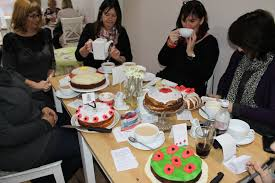

# Cake meeting bot 
# Returns the taste to meetings !!
 
The bot that will help you manage your refreshments at the meetings

Sending email to friends / group members who need to bring her to the next meeting.

How to run?

1. Add your teammates

2. If necessary, delete team members

3. Highlight the friend who brings a cake - and press the button to send the email

4. Update the order in the database for next time

Note :

Please note that the mailing list is not(!) updated automatically.

The email sent to the person who needs to bring a cake now and come in line

# Designed for high-tech companies that hold group meetings with food

